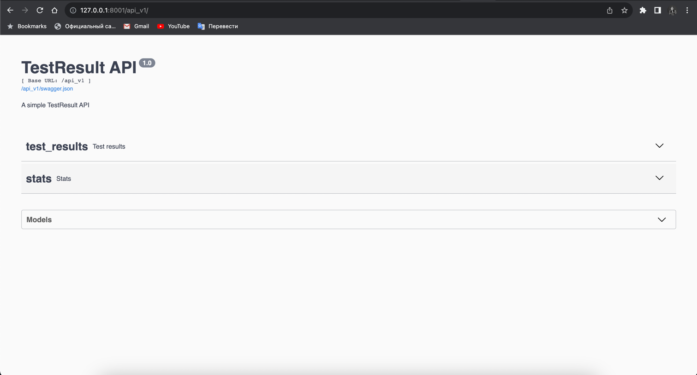

# test_stats
Create virtual environment:

python -m venv /path/to/new/virtual/environment

Install dependencies:

pip install -r requirements.txt

To run application:

sh run.sh

For writing data from csv file to database, run utils.py:

python3 utils.py

If you need, you can apply the changes described by the migration script to your database:

flask db upgrade

By default, app will be available on this url with Swagger documentation:

http://127.0.0.1:8001/api_v1/

